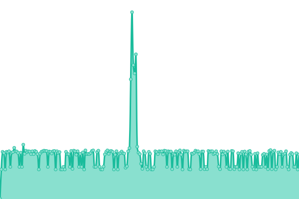

# [📈 Live Status](https://quyleanh.github.io/upptime): <!--live status--> **🟧 Partial outage**

This repository contains the open-source uptime monitor and status page for [Quy Le Anh](https://quyleanh.github.io/upptime), powered by [Upptime](https://github.com/upptime/upptime).

With [Upptime](https://upptime.js.org), you can get your own unlimited and free uptime monitor and status page, powered entirely by a GitHub repository. We use [Issues](https://github.com/quyleanh/upptime/issues) as incident reports, [Actions](https://github.com/quyleanh/upptime/actions) as uptime monitors, and [Pages](https://quyleanh.github.io/upptime) for the status page.

<!--start: status pages-->
<!-- This summary is generated by Upptime (https://github.com/upptime/upptime) -->
<!-- Do not edit this manually, your changes will be overwritten -->
<!-- prettier-ignore -->
| URL | Status | History | Response Time | Uptime |
| --- | ------ | ------- | ------------- | ------ |
|  [Billie](https://imblien.com) | 🟩 Up | [billie.yml](https://github.com/quyleanh/upptime/commits/HEAD/history/billie.yml) | 

 1088ms
     
 | 

<a href="https://quyleanh.github.io/upptime/history/billie">100.00%</a>
    

|  Vaultwarden | 🟩 Up | [vaultwarden.yml](https://github.com/quyleanh/upptime/commits/HEAD/history/vaultwarden.yml) | 

 705ms
     
 | 

<a href="https://quyleanh.github.io/upptime/history/vaultwarden">100.00%</a>
    

|  Adguard Home | 🟩 Up | [adguard-home.yml](https://github.com/quyleanh/upptime/commits/HEAD/history/adguard-home.yml) | 

 808ms
     
 | 

<a href="https://quyleanh.github.io/upptime/history/adguard-home">100.00%</a>
    

|  Adguard Home DoH | 🟩 Up | [adguard-home-do-h.yml](https://github.com/quyleanh/upptime/commits/HEAD/history/adguard-home-do-h.yml) | 

 153ms
     
 | 

<a href="https://quyleanh.github.io/upptime/history/adguard-home-do-h">100.00%</a>
    

|  Adguard Home DoT | 🟥 Down | [adguard-home-do-t.yml](https://github.com/quyleanh/upptime/commits/HEAD/history/adguard-home-do-t.yml) | 

 170ms
     
 | 

<a href="https://quyleanh.github.io/upptime/history/adguard-home-do-t">64.44%</a>
    

<!--end: status pages-->

[**Visit our status website →**](https://quyleanh.github.io/upptime)

## 📄 License

- Powered by: [Upptime](https://github.com/upptime/upptime)
- Code: [MIT](./LICENSE) © [Quy Le Anh](https://quyleanh.github.io/upptime)
- Data in the `./history` directory: [Open Database License](https://opendatacommons.org/licenses/odbl/1-0/)
